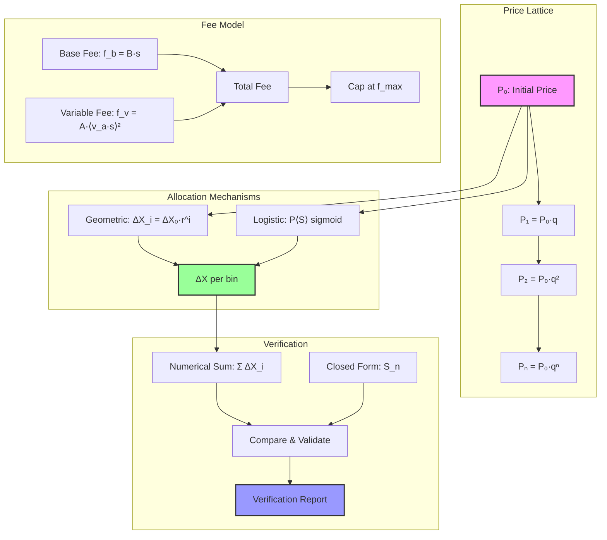
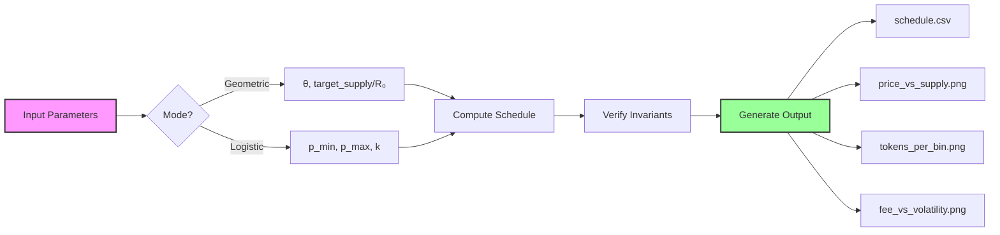

# DLMM Bonding Curve

Token allocation schedules on DLMM price lattices

## Model

* **Bin price lattice**: P_i = P_0(1 + bin_step/10,000)^i (DLMM formulas)
* **Geometric schedule**: ΔX_i = ΔX_0 r^i with r = q^(θ-1); closed form S_n = ΔX_0(1-r^n)/(1-r)
* **Logistic target**: P(S) = P_min + (P_max - P_min)/(1 + e^(-k(S - S_mid))) discretized via ΔX_i = S(P_{i+1}) - S(P_i)
* **Fees**: f = f_b + f_v, f_b = B·s, f_v = A·(v_a·s)^2 in decimal space; cap at f_max
* **Guards** (per docs):
  - X→Y: p_min = p_spot · 10,000/(10,000 - impact_bps)
  - Y→X: p_min = p_spot · (10,000 - impact_bps)/10,000

## Arch



### Flow

1. **Price Lattice**: Exponential grid P_i = P₀·q^i where q = 1 + bin_step/10,000
2. **Allocation**: Choose geometric (ΔX_i = ΔX₀·r^i) or logistic (sigmoid discretization)
3. **Fees**: Decimal-space simulation with base + variable components
4. **Verification**: Compare numerical summation against closed-form solution

## Install

```bash
curl --proto '=https' --tlsv1.2 -sSf https://sh.rustup.rs | sh
source $HOME/.cargo/env
cargo build --release
```

## Usage

### Workflow



### Examples

Geometric curve with target supply:
```bash
./target/release/bcurve \
  --mode geometric \
  --p0 0.01 --bin-step-bps 10 \
  --theta 0.6 \
  --target-supply 100000000 \
  --end-price 0.0175
```

Logistic S-curve:
```bash
./target/release/bcurve \
  --mode logistic \
  --p0 0.0015 --bin-step-bps 10 \
  --p-min 0.001 --p-max 0.05 \
  --k 0.00000008 \
  --end-price 0.03
```

## Output

All output files are written to the directory specified by `--out-dir` (defaults to `out/`):

* `schedule.csv`: Bin-by-bin allocation table with:
  ```
  bin,price,delta_x,supply_cum,revenue_bin,revenue_cum,
  fee_base,fee_var,fee_total,surcharge_launch_pct,fee_total_plus_surcharge
  ```
* `price_vs_supply.png`: Price vs cumulative supply
* `tokens_per_bin.png`: ΔX_i distribution
* `fee_vs_volatility.png`: Fee response function

Example:
```bash
# Create output directory and run with default output path
mkdir -p out/
./target/release/bcurve --mode geometric --p0 0.01 --bin-step-bps 10 --theta 0.6 --target-supply 100000000

# Or specify a custom output directory
./target/release/bcurve --mode geometric --p0 0.01 --bin-step-bps 10 --theta 0.6 --target-supply 100000000 --out-dir my_output/
```

## Parameters

### Core
* `--mode`: `geometric` or `logistic`
* `--p0`: Initial price (quote per base)
* `--bin-step-bps`: Bin step in basis points
* `--theta`: Geometric parameter (prefer 0<θ<1)

### Supply
* `--target-supply`: Target cumulative supply S*
* `--bins`: Number of bins
* `--end-price`: Terminal price (computes bins)
* `--r0`: Initial revenue R₀

### Logistic
* `--p-min`, `--p-max`: Price bounds
* `--k`: Steepness parameter
* `--s-mid`: Inflection point (auto-calibrated if 0)

### Fees
* `--base-factor`: Base fee factor B
* `--variable-fee-control`: Variable fee control A
* `--vol-accum`: Volatility accumulator
* `--max-fee-rate`: Maximum fee cap

## Testing

```bash
cargo test
```

Property tests verify:
* Closed-form equality S_n = ΔX_0(1-r^n)/(1-r)
* Price monotonicity P_i < P_{i+1}
* Non-negative allocations ΔX_i ≥ 0

## Integration

For Meteora DBC deployment:
* Supports up to 16 curve segments
* Convert to Q64.64 fixed-point for on-chain
* Use FEE_PRECISION scaling for integer fee mode

## References

* [DLMM Formulas - Meteora Documentation](https://docs.meteora.ag/developer-guide/guides/dlmm/dlmm-formulas)
* [Trading Fees Calculation - Meteora Documentation](https://docs.meteora.ag/overview/products/dbc/trading-fees-calculation)
* [Bonding Curve Formulas - Meteora Documentation](https://docs.meteora.ag/developer-guide/integrations/dbc/2-bonding-curve-formulas)